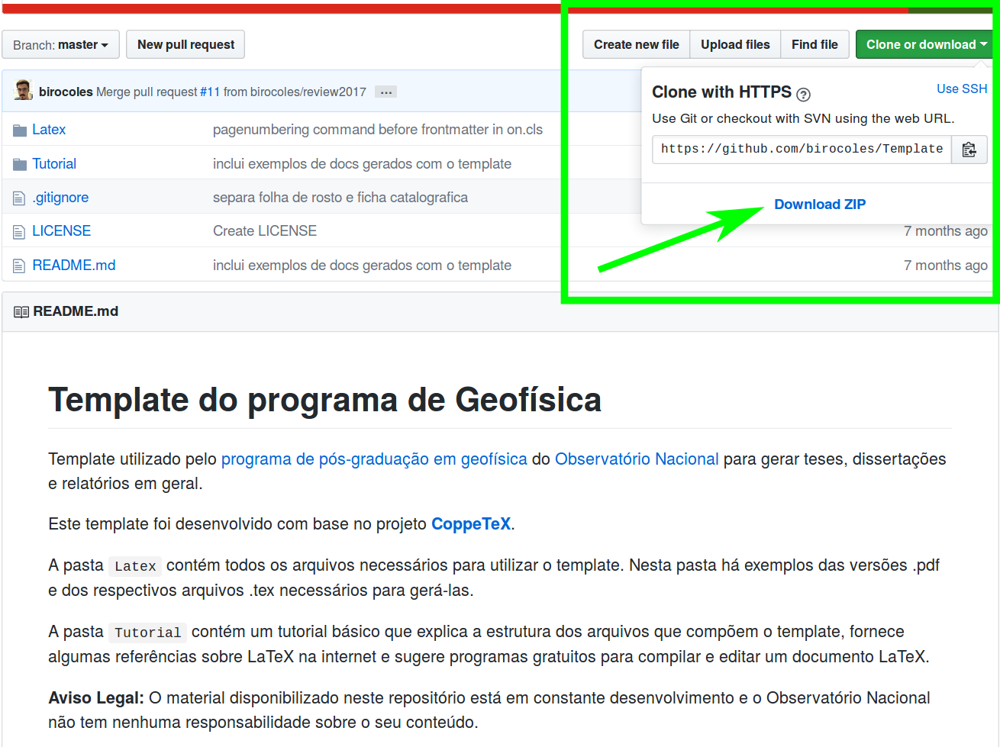

# Template do programa de Geofísica

Template utilizado pelo [programa de pós-graduação em geofísica](http://www.on.br/index.php/pt-br/programas-academicos/geofisica.html)
do [Observatório Nacional](http://www.on.br/index.php/pt-br/) para gerar teses, dissertações e relatórios em geral.

Este template foi desenvolvido com base no projeto [**CoppeTeX**](http://coppetex.sourceforge.net/).

A pasta `Latex` contém todos os arquivos necessários para utilizar o template. Nesta pasta há exemplos das versões .pdf e dos respectivos arquivos .tex necessários para gerá-las.

A pasta `Tutorial` contém um tutorial básico que explica a estrutura dos arquivos que compõem o template, fornece algumas referências sobre LaTeX na internet e sugere programas gratuitos para compilar e editar um documento LaTeX.

**IMPORTANTE:** OS EXEMPLOS DAS PASTAS `Exemplo-XXXX` PODEM ESTAR DESATUALIZADOS. OS ARQUIVOS DA PASTA `Latex` ESTÃO ATUALIZADOS.

**Aviso Legal:** O material disponibilizado neste repositório está em constante desenvolvimento e o Observatório Nacional não tem nenhuma responsabilidade sobre o seu conteúdo.

## Download do template

Para baixar o conteúdo do template:

1. Clique no botão verde "Clone or download" localizado no canto
direito desta página.

2. Clique em "Download ZIP" (veja a figura abaixo).

## Licença

Todo o conteúdo deste repositório está disponibilizado sob a [MIT License](https://github.com/birocoles/Templates-geofisica-ON/blob/master/LICENSE).
